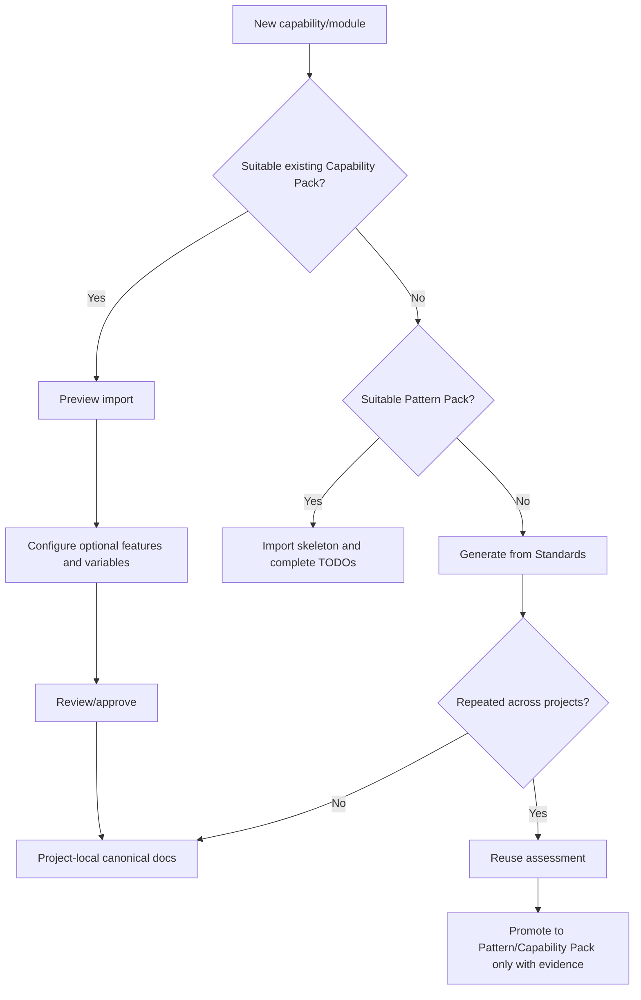

# Reuse Model in v4

V4 uses four reuse levels:

1. **Template** - structure only.
2. **Standard** - reusable rules/checklists.
3. **Pattern Pack** - reusable skeleton and relationship pattern.
4. **Capability Pack** - versioned, substantially complete reusable capability.

## Decision flow

## Rule of thumb
A capability normally needs at least three occurrences, 70%+ similarity and stable semantics before becoming a Capability Pack. Security/cross-cutting baselines may justify earlier promotion.

AUTH is the reference Capability Pack. COMMON CRUD is the reference Pattern Pack.
