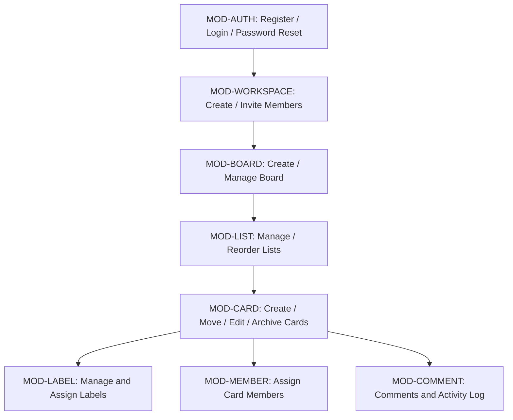

# Functional Overview

| Module | Purpose |
|---|---|
| `MOD-AUTH` | Account lifecycle: register, login, forgot/reset password. Issues the session (JWT access + refresh token, `ADR-002`) every other module depends on. |
| `MOD-WORKSPACE` | Top-level tenant boundary: create a workspace, invite/manage members and roles. |
| `MOD-BOARD` | Create and manage Boards inside a Workspace (settings, background, visibility, star, archive). |
| `MOD-LIST` | Manage Lists (columns) on a Board, including drag-and-drop reorder. |
| `MOD-CARD` | The core work item: create, drag-and-drop move (within/across Lists), edit detail, archive. |
| `MOD-LABEL` | Board-scoped labels and assigning them to Cards. |
| `MOD-MEMBER` | Assigning Board/Workspace members to individual Cards. |
| `MOD-COMMENT` | Card comments and the automatically generated activity log. |

See `PROJECT_BLUEPRINT.md` for the full Feature/Screen/API/Database inventory per module.
