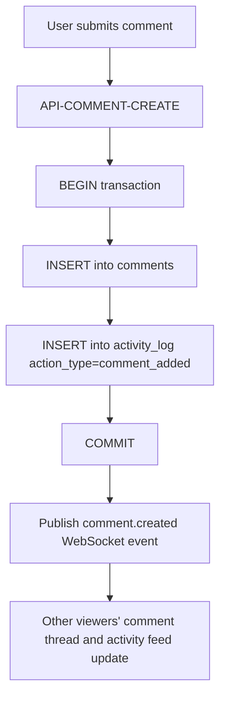

# Flow

## Purpose
Show how posting a comment atomically produces both the comment itself and its corresponding activity-log entry, and how that entry reaches other viewers.

## Actors / Systems
Workspace member, Node.js API, PostgreSQL, WebSocket broadcaster.

## Preconditions
Card exists and is not archived.

## Flow Diagram

## Step Details

| Step | Actor/System | Action | Rule/API/Screen | Result |
|---|---|---|---|---|
| 1 | User | Submits a comment | SCR-CARD-DETAIL | Request sent |
| 2 | API | Inserts comment + activity row in one transaction | API-COMMENT-CREATE, DB-COMMENT, DB-ACTIVITY-LOG | Both rows committed together |
| 3 | Broadcaster | Publishes event | ARCH-004 | Other viewers notified |
| 4 | Other clients | Append to thread and feed | FEAT-ACTIVITY-LOG, API-ACTIVITY-LIST | Synced view |

## Error / Retry Paths
If the transaction fails (e.g. database error), neither the comment nor the activity entry is persisted — they are never allowed to diverge.

## End States
Comment visible in the thread; exactly one new activity-log entry visible in the feed, for every viewer.
