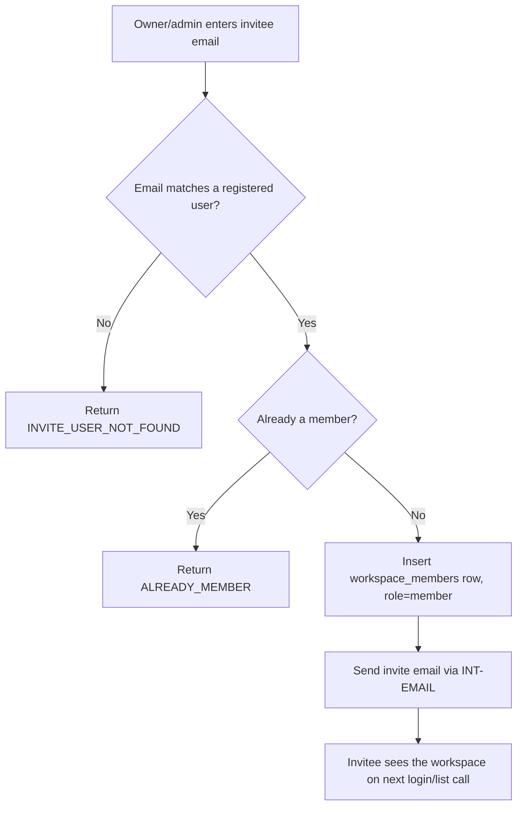

# Flow

## Purpose
Show the business process of inviting a teammate into a Workspace, including the v1 constraint that the invitee must already hold an account.

## Actors / Systems
Workspace owner/admin, invited user, Node.js API, email provider (`INT-EMAIL`).

## Preconditions
Actor holds `owner`/`admin` role in the target Workspace.

## Flow Diagram

## Step Details

| Step | Actor/System | Action | Rule/API/Screen | Result |
|---|---|---|---|---|
| 1 | Owner/admin | Submits invitee email | SCR-WORKSPACE-SETTINGS | Request sent |
| 2 | API | Resolves email to user | BR-WORKSPACE-002 | Found / not found branch |
| 3 | API | Checks existing membership | BR-WORKSPACE-002 | New / duplicate branch |
| 4 | API | Inserts membership | DB-WORKSPACE-MEMBER | Member added |
| 5 | API | Sends notification | INT-EMAIL | Invitee notified |

## Error / Retry Paths
`INVITE_USER_NOT_FOUND`: owner/admin must ask the invitee to register first, then retry the invite. `ALREADY_MEMBER`: no retry needed, informational only.

## End States
Invitee is a `member` of the Workspace and can see its Boards on their next workspace list fetch.
