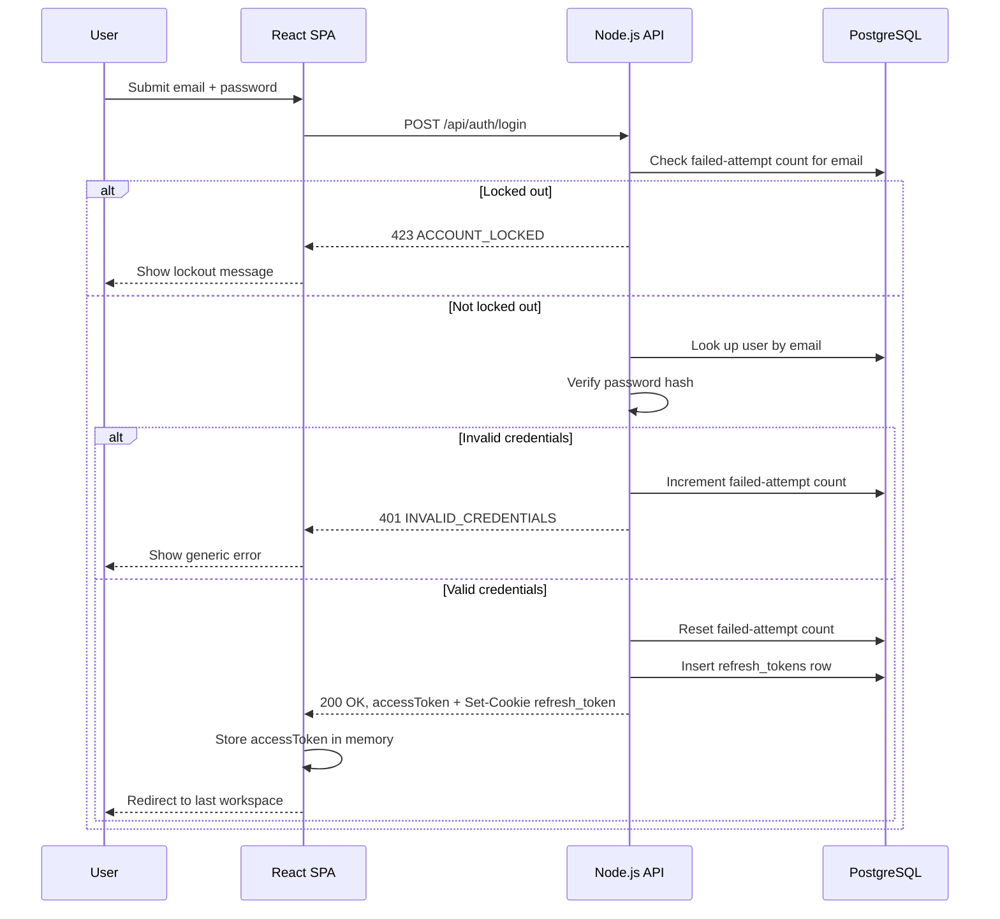

# Flow

## Purpose
Show the full login sequence, including the account-lockout check and session issuance.

## Actors / Systems
User (browser), React SPA, Node.js API, PostgreSQL.

## Preconditions
User has a registered account and is not currently locked out.

## Flow Diagram

## Step Details

| Step | Actor/System | Action | Rule/API/Screen | Result |
|---|---|---|---|---|
| 1 | User | Submits credentials | SCR-LOGIN | Form submitted |
| 2 | API | Checks lockout state | BR-AUTH-002 | Proceed or reject |
| 3 | API | Verifies password | API-AUTH-LOGIN | Success/failure branch |
| 4 | API | Issues session | ADR-002, DB-REFRESH-TOKEN | Access token + refresh cookie |
| 5 | SPA | Redirects user | SCR-WORKSPACE-HOME | Authenticated session active |

## Error / Retry Paths
Invalid credentials and lockout are terminal for that request; the user retries the form. No automatic retry on the client for `401`/`423`.

## End States
Authenticated session established (success) or user remains on `SCR-LOGIN` with an inline error (failure).
