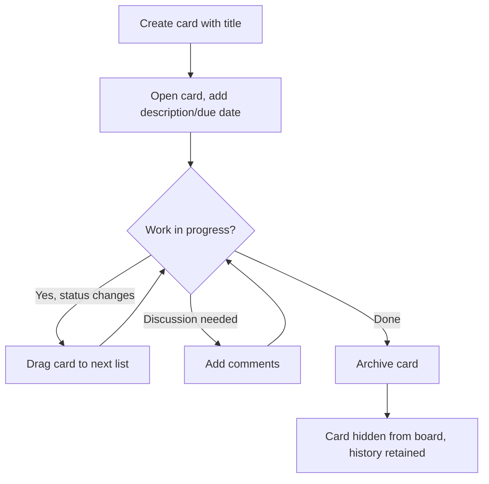

# Flow

## Purpose
Show the typical end-to-end user journey a single Card goes through, from creation to archiving.

## Actors / Systems
Workspace member(s) using `SCR-BOARD` and `SCR-CARD-DETAIL`.

## Preconditions
An active Board with at least one List exists.

## Flow Diagram

## Step Details

| Step | Actor/System | Action | Rule/API/Screen | Result |
|---|---|---|---|---|
| 1 | User | Creates the card | FEAT-CARD-CREATE, API-CARD-CREATE | Card exists in first list |
| 2 | User | Fills in detail | FEAT-CARD-EDIT-DETAIL, API-CARD-UPDATE | Description/due date set |
| 3 | User(s) | Move card as status changes | FEAT-CARD-MOVE, API-CARD-MOVE | Card progresses across lists |
| 4 | User(s) | Discuss | FEAT-COMMENT-ADD | Comment thread grows |
| 5 | User | Archives when done | FEAT-CARD-ARCHIVE, API-CARD-ARCHIVE | Card removed from active view |

## Error / Retry Paths
See `FLOW-CARD-MOVE-DRAGDROP` for the move step's detailed conflict handling.

## End States
Card is archived with a complete activity history (`FEAT-ACTIVITY-LOG`) retained for later reference.
