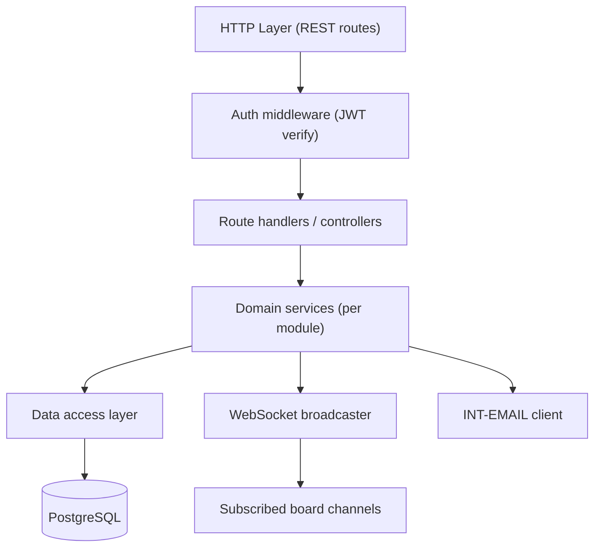

# Architecture Document

## Context
The backend is a Node.js REST + WebSocket API, the single point of contact with PostgreSQL (`ADR-001`) and the only component with business-logic/authorization responsibility.

## Goals / Constraints
Must enforce every business rule in `docs/04-business-rules/` server-side (never trust client-side validation alone); must meet `NFR-PERF-001` and `NFR-SCALE-001`.

## Applicable Standards
`standards/project-types/api/api-architecture.md`, `standards/project-types/api/api-conventions.md`, `standards/project-types/api/auth-authorization.md`, `standards/project-types/api/data-transaction.md`, `standards/stacks/api/nodejs/architecture.md`, `standards/stacks/api/nodejs/coding-standard.md`, `standards/stacks/api/nodejs/validation-errors.md`.

## Components

## Diagram
See the `flowchart` above. Each `MOD-*` module maps to one domain-service module in the codebase (e.g. `cardService`, `workspaceService`), each owning its slice of `docs/07-api/` contracts and `docs/04-business-rules/` enforcement.

## Responsibilities / Boundaries
- **Auth middleware**: verifies the JWT access token, attaches the authenticated user to the request context; every route except the anonymous auth endpoints requires it.
- **Route handlers**: thin — parse/validate input shape, call the matching domain service, map results/errors to the response envelope (`docs/07-api/conventions.md`).
- **Domain services**: own business-rule enforcement and transaction boundaries (one service method = one documented API's "Transaction Boundary" section).
- **Data access layer**: parameterized SQL/query builder against PostgreSQL; no business logic here.
- **WebSocket broadcaster**: fan-out of domain events to board-scoped subscriber lists (`ARCH-004`).

## Data Flow
HTTP request -> auth middleware -> handler -> service (business rules + one DB transaction) -> handler maps response -> (on success) broadcaster emits the corresponding WebSocket event.

## Error / Resilience Strategy
All domain errors are typed (matching the `code` values documented per API, e.g. `CARD_MOVE_CONFLICT`); unexpected errors map to a generic `500 INTERNAL_ERROR` without leaking internals, per `standards/stacks/api/nodejs/validation-errors.md`.

## Security Considerations
See `docs/10-security/`.

## Scalability / Performance
Stateless HTTP layer scales horizontally; WebSocket connections require either sticky session routing or a shared pub/sub layer across instances once the API runs on more than one node — noted as an operational consideration for when `NFR-SCALE-001` targets are exceeded, not a blocker at MVP scale (single instance acceptable initially).

## Deployment Considerations
See `docs/12-devops/environments.md`.

## Related ADRs
`ADR-001`, `ADR-002`, `ADR-003`, `ADR-004`

## Risks / Open Questions
Multi-instance WebSocket fan-out strategy is a known future scaling task, not yet an open question requiring a decision at current scale.
