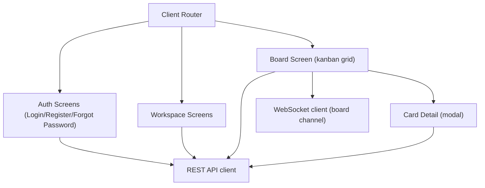

# Architecture Document

## Context
The frontend is a React single-page application (`ADR-006`) implementing every screen in `docs/05-screens/`.

## Goals / Constraints
Must support optimistic UI for drag-and-drop (`FEAT-CARD-MOVE`, `FEAT-LIST-REORDER`) and live updates from the WebSocket channel (`ADR-004`); must meet `NFR-BROWSER-001` and `NFR-A11Y-001`.

## Applicable Standards
`standards/stacks/web/reactjs/architecture.md`, `standards/stacks/web/reactjs/routing.md`, `standards/stacks/web/reactjs/state-data-fetching.md`, `standards/stacks/web/reactjs/forms-validation.md`, `standards/stacks/web/reactjs/testing.md`.

## Components

## Diagram
See the `flowchart` above, mirroring the route structure in `PROJECT_BLUEPRINT.md`'s Screens/Routes table.

## Responsibilities / Boundaries
- **Router**: client-side routing matching the routes in `PROJECT_BLUEPRINT.md`.
- **REST API client**: thin fetch wrapper applying the `Authorization` header and the error-envelope convention (`docs/07-api/conventions.md`); handles silent access-token refresh.
- **WebSocket client**: subscribes to the current board's channel on `SCR-BOARD`/`SCR-CARD-DETAIL` mount, unsubscribes on unmount; dispatches incoming events into the same state layer that optimistic local updates use, so both paths converge to one rendered state.
- **Board screen**: owns drag-and-drop state and the optimistic-then-reconcile pattern described in `FLOW-CARD-MOVE-DRAGDROP`.

## Data Flow
User action -> local optimistic state update -> API call -> on success, reconcile with server response; on error, revert and show a toast. Independently, WebSocket events from other users' actions apply the same reconcile path.

## Error / Resilience Strategy
API client retries `5xx`/network errors with backoff per `docs/07-api/conventions.md`; `4xx` errors surface as inline/toast messages, never silently retried.

## Security Considerations
Access token held in memory only (not localStorage) per `ADR-002`; refresh token is an httpOnly cookie the SPA never reads directly.

## Scalability / Performance
Board screen virtualizes/paginates only if card counts exceed comfortable DOM sizes in future (not needed at `NFR-SCALE-001` target volumes for v1).

## Deployment Considerations
Built as static assets, deployed to a CDN/static host; see `docs/12-devops/environments.md`.

## Related ADRs
`ADR-004`, `ADR-006`

## Risks / Open Questions
None blocking.
