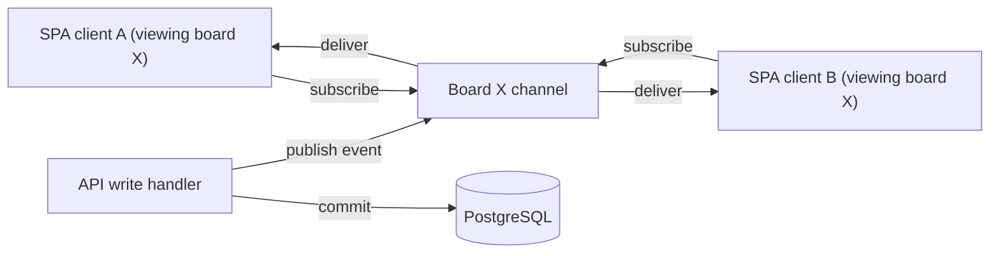

# Architecture Document

## Context
Per `ADR-004`, the system propagates board changes to all connected viewers over WebSocket rather than polling.

## Goals / Constraints
Meet `NFR-PERF-002` (P95 < 500ms event delivery); never let a broadcast failure block the originating write (broadcast happens strictly after the write transaction commits).

## Applicable Standards
`standards/project-types/api/resilience.md`.

## Components

## Diagram
See the `flowchart` above.

## Responsibilities / Boundaries
- A client subscribes to exactly one board channel at a time (`/ws/boards/{boardId}`), established when `SCR-BOARD` or `SCR-CARD-DETAIL` mounts and torn down on unmount/navigation away.
- Every write API (`API-CARD-MOVE`, `API-LIST-REORDER`, `API-CARD-CREATE`, `API-CARD-ARCHIVE`, `API-LABEL-ASSIGN`/`API-LABEL-REMOVE`, `API-CARD-MEMBER-ASSIGN`/`API-CARD-MEMBER-REMOVE`, `API-COMMENT-CREATE`/`API-COMMENT-UPDATE`/`API-COMMENT-DELETE`) publishes exactly one typed event to the acting board's channel after its transaction commits.
- The originating client ignores its own echoed event (matched by a client-generated request id) since it already applied the change optimistically.

## Data Flow
See `FLOW-CARD-MOVE-DRAGDROP` for the canonical end-to-end sequence.

## Error / Resilience Strategy
If a client's WebSocket connection drops, it reconnects and re-fetches the board's current state via `API-BOARD-GET-DETAIL` to resynchronize (a missed event is never silently lost — the full-state refetch is the recovery path, not event replay).

## Security Considerations
The WebSocket handshake carries the same JWT access token as REST calls; the server verifies board/workspace membership before allowing a subscription.

## Scalability / Performance
Single-instance pub/sub is sufficient at MVP scale (`NFR-SCALE-001`); horizontally scaling the API to multiple instances requires a shared pub/sub backend (e.g. Redis) to fan events out across instances — a known future task, not yet required.

## Deployment Considerations
WebSocket connections require the load balancer/proxy in front of the API to support long-lived connections (see `docs/12-devops/environments.md`).

## Related ADRs
`ADR-004`

## Risks / Open Questions
Multi-instance fan-out strategy (future scaling task, not a current open question).
