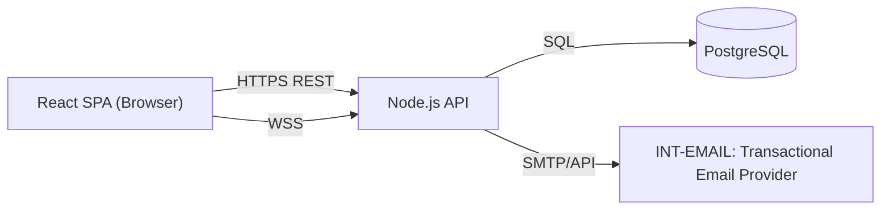

# Architecture Document

## Context
KanbanFlow has three deployable components: a React single-page application, a Node.js API (REST + WebSocket), and a PostgreSQL database. End users interact only through the browser; the only external dependency is a transactional email provider.

## Goals / Constraints
Single-region MVP deployment (`NFR-SCALE-001`); no SSO/third-party auth providers in v1; no payment/billing integrations.

## Applicable Standards
`standards/project-types/web/web-architecture.md`, `standards/project-types/api/api-architecture.md`, `standards/stacks/web/reactjs/architecture.md`, `standards/stacks/api/nodejs/architecture.md`, `standards/stacks/database/postgresql/schema-conventions.md`.

## Components

## Diagram
See the `flowchart` above. The React SPA is served as static assets (CDN/static hosting); the Node.js API is the only component that talks to PostgreSQL and the email provider.

## Responsibilities / Boundaries
- **React SPA**: all UI rendering, optimistic UI for drag-and-drop, client-side routing. Holds no durable state of its own beyond transient UI state and the in-memory access token.
- **Node.js API**: all business logic, validation, authorization, and the single source of truth for data via PostgreSQL. Also hosts the WebSocket broadcast layer (`ARCH-004`).
- **PostgreSQL**: durable storage (`docs/08-database/`).
- **INT-EMAIL**: outbound transactional email only (password reset, workspace invite); no inbound dependency on it.

## Data Flow
Every state-changing user action flows: SPA -> REST API -> PostgreSQL transaction -> WebSocket broadcast -> other subscribed SPA instances. See `docs/06-flows/system/FLOW-CARD-MOVE-DRAGDROP.md` for the canonical example.

## Error / Resilience Strategy
API returns structured errors per `docs/07-api/conventions.md`; the SPA reconciles optimistic UI state on any error response. No circuit breakers/retries to external dependencies beyond `INT-EMAIL` are needed at this scale (a single outbound integration, not in the critical path of any read).

## Security Considerations
See `docs/10-security/`.

## Scalability / Performance
See `NFR-PERF-001`, `NFR-SCALE-001`, `NFR-PERF-002`.

## Deployment Considerations
See `docs/12-devops/environments.md`.

## Related ADRs
`ADR-001`, `ADR-002`, `ADR-004`, `ADR-006`

## Risks / Open Questions
`OQ-005` (final email provider selection for `INT-EMAIL`).
