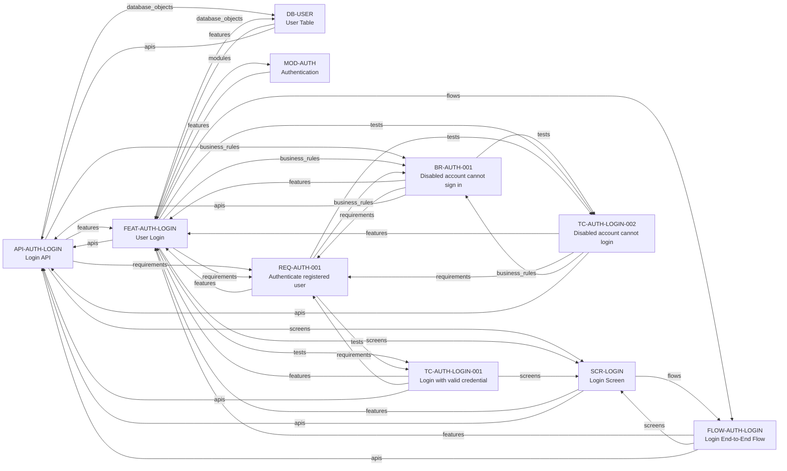

# Generated Project Graph

> The static website also contains an interactive graph with pan/zoom and click-through navigation.

```mermaid
flowchart LR
  N_API_AUTH_LOGIN["API-AUTH-LOGIN\nLogin API"]
  N_BR_AUTH_001["BR-AUTH-001\nDisabled account cannot sign in"]
  N_DB_USER["DB-USER\nUser Table"]
  N_FEAT_AUTH_LOGIN["FEAT-AUTH-LOGIN\nUser Login"]
  N_FLOW_AUTH_LOGIN["FLOW-AUTH-LOGIN\nLogin End-to-End Flow"]
  N_MOD_AUTH["MOD-AUTH\nAuthentication"]
  N_REQ_AUTH_001["REQ-AUTH-001\nAuthenticate registered user"]
  N_SCR_LOGIN["SCR-LOGIN\nLogin Screen"]
  N_TC_AUTH_LOGIN_001["TC-AUTH-LOGIN-001\nLogin with valid credential"]
  N_TC_AUTH_LOGIN_002["TC-AUTH-LOGIN-002\nDisabled account cannot login"]
  N_API_AUTH_LOGIN -->|features| N_FEAT_AUTH_LOGIN
  N_API_AUTH_LOGIN -->|requirements| N_REQ_AUTH_001
  N_API_AUTH_LOGIN -->|business_rules| N_BR_AUTH_001
  N_API_AUTH_LOGIN -->|screens| N_SCR_LOGIN
  N_API_AUTH_LOGIN -->|database_objects| N_DB_USER
  N_BR_AUTH_001 -->|features| N_FEAT_AUTH_LOGIN
  N_BR_AUTH_001 -->|requirements| N_REQ_AUTH_001
  N_BR_AUTH_001 -->|apis| N_API_AUTH_LOGIN
  N_BR_AUTH_001 -->|tests| N_TC_AUTH_LOGIN_002
  N_DB_USER -->|features| N_FEAT_AUTH_LOGIN
  N_DB_USER -->|apis| N_API_AUTH_LOGIN
  N_FEAT_AUTH_LOGIN -->|modules| N_MOD_AUTH
  N_FEAT_AUTH_LOGIN -->|requirements| N_REQ_AUTH_001
  N_FEAT_AUTH_LOGIN -->|business_rules| N_BR_AUTH_001
  N_FEAT_AUTH_LOGIN -->|screens| N_SCR_LOGIN
  N_FEAT_AUTH_LOGIN -->|flows| N_FLOW_AUTH_LOGIN
  N_FEAT_AUTH_LOGIN -->|apis| N_API_AUTH_LOGIN
  N_FEAT_AUTH_LOGIN -->|database_objects| N_DB_USER
  N_FEAT_AUTH_LOGIN -->|tests| N_TC_AUTH_LOGIN_001
  N_FEAT_AUTH_LOGIN -->|tests| N_TC_AUTH_LOGIN_002
  N_FLOW_AUTH_LOGIN -->|features| N_FEAT_AUTH_LOGIN
  N_FLOW_AUTH_LOGIN -->|screens| N_SCR_LOGIN
  N_FLOW_AUTH_LOGIN -->|apis| N_API_AUTH_LOGIN
  N_MOD_AUTH -->|features| N_FEAT_AUTH_LOGIN
  N_REQ_AUTH_001 -->|features| N_FEAT_AUTH_LOGIN
  N_REQ_AUTH_001 -->|business_rules| N_BR_AUTH_001
  N_REQ_AUTH_001 -->|tests| N_TC_AUTH_LOGIN_001
  N_REQ_AUTH_001 -->|tests| N_TC_AUTH_LOGIN_002
  N_SCR_LOGIN -->|features| N_FEAT_AUTH_LOGIN
  N_SCR_LOGIN -->|apis| N_API_AUTH_LOGIN
  N_SCR_LOGIN -->|flows| N_FLOW_AUTH_LOGIN
  N_TC_AUTH_LOGIN_001 -->|features| N_FEAT_AUTH_LOGIN
  N_TC_AUTH_LOGIN_001 -->|requirements| N_REQ_AUTH_001
  N_TC_AUTH_LOGIN_001 -->|screens| N_SCR_LOGIN
  N_TC_AUTH_LOGIN_001 -->|apis| N_API_AUTH_LOGIN
  N_TC_AUTH_LOGIN_002 -->|features| N_FEAT_AUTH_LOGIN
  N_TC_AUTH_LOGIN_002 -->|requirements| N_REQ_AUTH_001
  N_TC_AUTH_LOGIN_002 -->|business_rules| N_BR_AUTH_001
  N_TC_AUTH_LOGIN_002 -->|apis| N_API_AUTH_LOGIN
```
