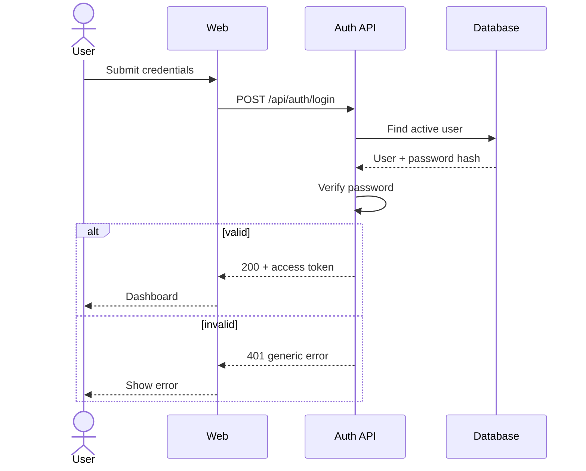

# Login API

## Request

```json
{
  "email": "user@example.com",
  "password": "********"
}
```

## Response

```json
{
  "accessToken": "<token>",
  "expiresIn": 3600
}
```

## Sequence


```mermaid
sequenceDiagram
  actor U as User
  participant W as Web
  participant A as Auth API
  participant D as Database
  U->>W: Submit credentials
  W->>A: POST /api/auth/login
  A->>D: Find active user
  D-->>A: User + password hash
  A->>A: Verify password
  alt valid
    A-->>W: 200 + access token
    W-->>U: Dashboard
  else invalid
    A-->>W: 401 generic error
    W-->>U: Show error
  end
```
