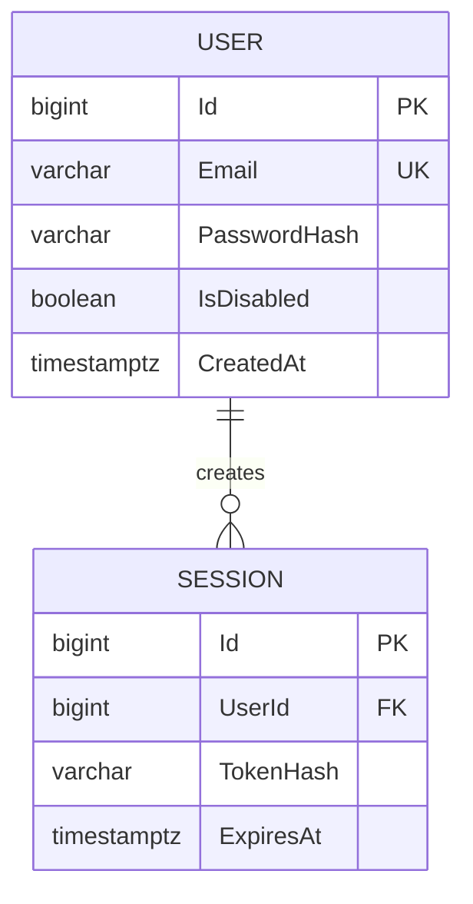

# User Table

## Logical model

```mermaid
erDiagram
  USER {
    bigint Id PK
    varchar Email UK
    varchar PasswordHash
    boolean IsDisabled
    timestamptz CreatedAt
  }
  USER ||--o{ SESSION : creates
  SESSION {
    bigint Id PK
    bigint UserId FK
    varchar TokenHash
    timestamptz ExpiresAt
  }
```
