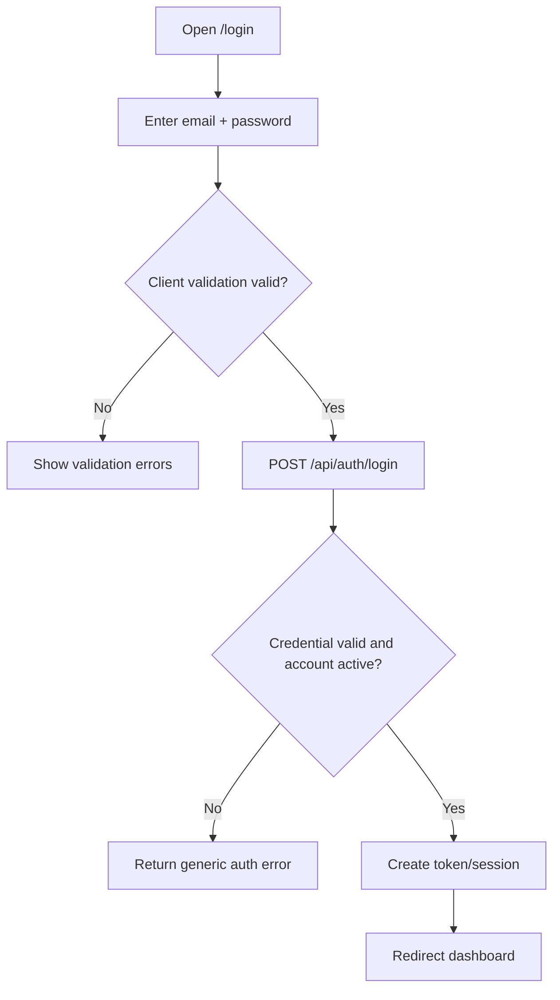

# Login End-to-End Flow

```mermaid
flowchart TD
  A[Open /login] --> B[Enter email + password]
  B --> C{Client validation valid?}
  C -- No --> D[Show validation errors]
  C -- Yes --> E[POST /api/auth/login]
  E --> F{Credential valid and account active?}
  F -- No --> G[Return generic auth error]
  F -- Yes --> H[Create token/session]
  H --> I[Redirect dashboard]
```
