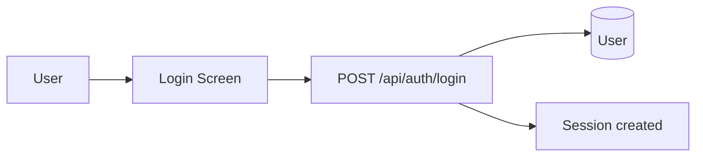

# Authentication Module

Quản lý đăng nhập và session của người dùng.

## Feature map

```mermaid
flowchart LR
  U[User] --> L[Login Screen]
  L --> A[POST /api/auth/login]
  A --> D[(User)]
  A --> S[Session created]
```
