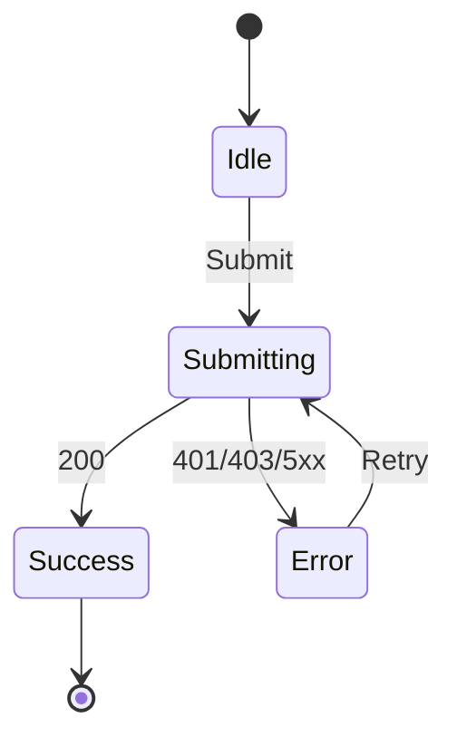

# Login Screen

## Controls

| Control | Required | Notes |
|---|---:|---|
| Email | Yes | Email format validation |
| Password | Yes | Masked input |
| Login | Yes | Disabled while submitting |

## Screen states

