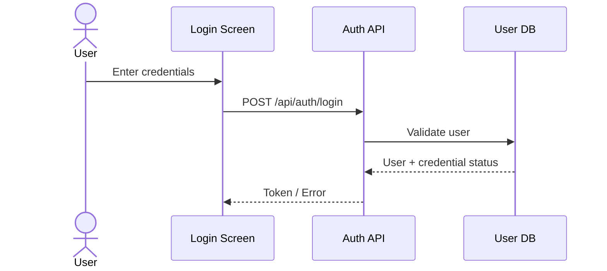

# Flow & Diagram Guidelines

Dùng Mermaid hoặc diagram portable. Mỗi diagram phải có textual explanation đi kèm.

## Loại diagram khuyến nghị

- User Journey: actor -> screen/action -> outcome.
- Business Flow: state/decision/business rule.
- Sequence: Screen -> API -> Service -> DB/Integration.
- Architecture: Browser -> Frontend -> API -> DB/Cache/External.
- State Machine: trạng thái entity và transition.

## Mermaid example

