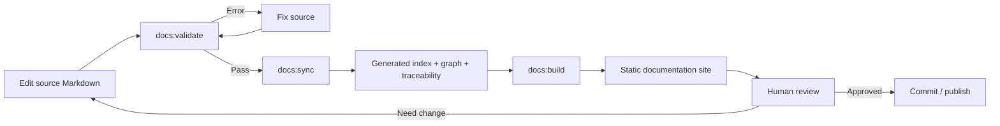

# Workflow 08 — Validate, Sync and Publish Documentation

## Mục tiêu

Sau khi tài liệu được tạo/update, biến source Markdown thành một knowledge site có thể review trực quan và tự động kiểm tra consistency.

## Flow



## Step 1 — Validate

```bash
cd tools
npm run docs:validate
```

Resolve tất cả `ERRORS`. Review warnings về traceability/orphan/stale docs.

## Step 2 — Sync

```bash
npm run docs:sync
```

Review `docs/_generated/DOCUMENT_HEALTH.md` và `TRACEABILITY_MATRIX.md`.

## Step 3 — Build web

```bash
npm run docs:build
npm run docs:serve
```

Review Dashboard, Catalog, Traceability, Graph và Diagram Gallery.

## Step 4 — Development/watch mode

Khi đang chỉnh nhiều tài liệu:

```bash
npm run docs:dev
```

## Step 5 — CI gate

CI nên chạy `npm ci && npm run docs:all` từ `tools/`.
