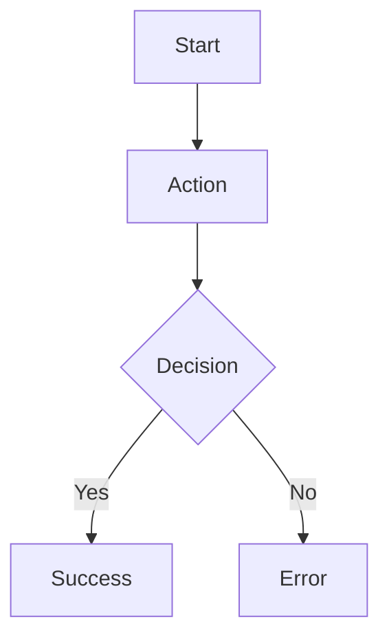

# Flow

## Purpose

## Actors / Systems

## Preconditions

## Flow Diagram

## Step Details

| Step | Actor/System | Action | Rule/API/Screen | Result |
|---|---|---|---|---|

## Error / Retry Paths

## End States
